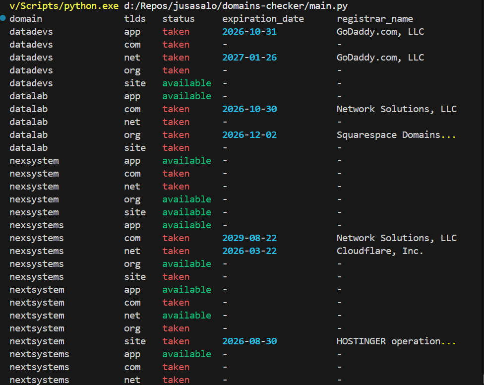

# Domains Checker

Herramienta CLI en Python para validar si estas disponibles o tomados (`taken`/`available`) y devolver con quien se hizo el registo.
Tambien puede verificar si variantes del dominio con letras en vez de numeros, tambien estan disponibles.



## ¿Qué hace este proyecto?

- Lee dominios base y TLDs desde `domains.json`.
- Genera candidatos:
  - `dominio.com`
  - `dominio.net`
  - `dominio.site`
  - `dominio.org`
  - `dominio.app`
  - `dominio.etc`
  - variantes tipográficas según `config.json`.
- Ejecuta chequeos concurrentes:
  - DNS
  - HTTP/HTTPS
  - TLS (si aplica)
  - Registrar (RDAP) para `registrar_name`, `registrar_url` y `expiration_date` cuando esté disponible.
- Clasifica cada dominio como:
  - `taken`
  - `available`
  - `unknown`
- Exporta resultados a JSON y CSV, y muestra salida en consola.

## Estructura principal

- `main.py`: entrypoint del script.
- `domains.json`: dominios base y TLDs a revisar.
- `config.json`: timeouts, variaciones, formato de salida y columnas.
- `modules/`: lógica modular (checks, core, reporting, config, utils).
- `output/`: resultados generados (`results.json`, `results.csv`).

## Requisitos

- Python 3.9+
- Dependencias en `requirements.txt`

Instalación rápida:

```powershell
python -m venv .venv
.\.venv\Scripts\Activate.ps1
pip install -r requirements.txt
```

## Uso

Ejecución con archivos por defecto (`domains.json` y `config.json`):

```powershell
.\.venv\Scripts\python main.py
```

También puedes indicar rutas explícitas:

```powershell
.\.venv\Scripts\python main.py --domains-file domains.json --config-file config.json
```

## Configuración

### `domains.json`

```json
{
  "domains": ["datadevs", "datalab"],
  "tlds": ["com", "net", "app", "site"]
}
```

### `config.json`

Parámetros más importantes:

- `variations`: reglas de sustitución (ej. `o -> 0`, `i -> 1`).
- `timeout_seconds`: timeout por intento.
- `check_ssl`: habilita validaciones TLS.
- `output.format`: `json`, `csv` o ambos.
- `output.columns`: columnas visibles en consola/CSV y en el bloque principal del JSON.
- `output.console_domain_width`: ancho base de la columna `domain` en consola.
- `output.console_column_widths`: ancho por columna para consola.

## Salidas

- `output/results.csv`
  - Solo columnas configuradas en `output.columns`.
- `output/results.json`
  - Incluye columnas configuradas + secciones técnicas completas:
    - `dns`
    - `http`
    - `tls`
    - `errors`

## Notas

- `expiration_date`, `registrar_name` y `registrar_url` dependen de lo que exponga RDAP para cada TLD/registrar.
- Si un registro RDAP no publica ciertos datos, esos campos pueden venir vacíos.
